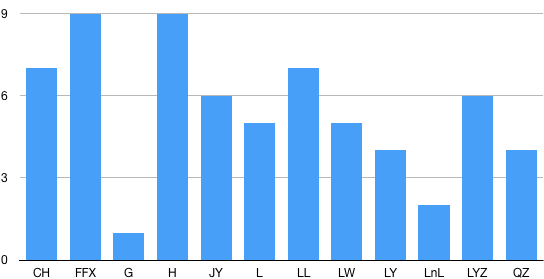
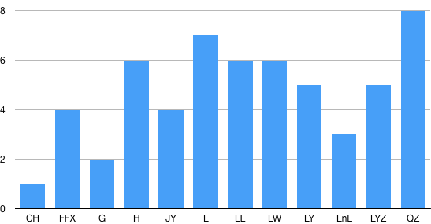

Final Projects
=====

## Spring 2019

* HenNet: Hierarchical Entity-Aware Network for Conversational Question Answering
  * Jason Choi, Harshita Sahijwani
  * [Abstract](https://drive.google.com/open?id=1KHa7kFR8NTa-M_yzSYheOqM5Hi_Y3ATJ), [Proposal](https://drive.google.com/open?id=15Gj4-yLnLGYChzxZaNfodIk6b8JiI3oM) ([slides](https://drive.google.com/open?id=16CVlqkDeZSb2M8xttwQWNL4c6nWLR4r8)), [Final](https://drive.google.com/open?id=1nARVya9tPyZsbVG92hsnjPWbYxnmnkem) ([slides](https://drive.google.com/open?id=1H1qVeDXfI1Kcu3EAjlCIVeQGRp0Pi_by))
* Minimally Supervised Cross Document Coreference Resolution on News Data
  * Sarah Fillwock, James Finch, Liyan Xu
  * [Abstract](https://drive.google.com/open?id=1ech7eO-WiJLz_L9zKW9G7Rhs17qFqFPJ), [Proposal](https://drive.google.com/open?id=1rM718e7tplLLUszgLyQiL3-CmrabT7Mw) ([slides](https://drive.google.com/open?id=11rDJze8uqTquevd1Aqx8qVWZAOss719I)), [Final](https://drive.google.com/open?id=1JLkKUrmoFuMtwE5MRhdGKpTJB4AVC5O4) ([slides](https://drive.google.com/open?id=1ZMqqpG-ng-sRuAEMzoQ8AW8Q2yAuiGv6))
* IDF-weighted Context Vectors for MeSH Indexing
  * Zelalem Gero
  * [Abstract](https://drive.google.com/open?id=1RJy0hqnig3obxka7evSqprUgZQ0b4q-9), [Proposal](https://drive.google.com/open?id=1pHSDh69c1TSUzjvkgLpBofLUoTelp3uS) ([slides](https://drive.google.com/open?id=1Llj9KGqi_cViYqfYGwFYPAEupiW6bAag)), [Final](https://drive.google.com/open?id=13PgQlIG8c5JQ8UxOAgri4k0UKYbLyr8X) ([slides](https://drive.google.com/open?id=1YKSB_dLmgaV-WjhdmCAGYvlYv_ebtAej))
* BERT Character Language Model for Sequence Tagging
  * Han He
  * [Abstract](https://drive.google.com/open?id=1YGFJ6xCkfaSL8E95cXSoo-fhnMHlKuRb), [Proposal](https://drive.google.com/open?id=1j9RcWTzX7IC3hPXcLFkRtoFWHpQ5rG6S) ([slides](https://drive.google.com/open?id=1VjuyCwRM19sXEQSGgDDr37zi9WuLgKWF)), [Final](https://drive.google.com/open?id=1UskwdmuFtr-O-gHub50faaSgnJNg1RZj) ([slides](https://drive.google.com/open?id=1bizY-D_7VtrPT91vrYOSIIcHl0uybgVv))
* Incremental Sense Weight Training for the Interpretation of Contextualized Word Embeddings
  * Xinyi Jiang, Zhengzhe Yang
  * [Abstract](https://drive.google.com/open?id=1mbaB3SOH3zZyQ00Py7uwgc4eAUU-gbNv), [Proposal](https://drive.google.com/open?id=1tVT18s4vYZ9lI97yus3ygV0eT0ZsgE96) ([slides](https://drive.google.com/open?id=1cDcXApAL6NzRCKfe1lSyDVmea1JtAhkP)), [Final](https://drive.google.com/open?id=19zljPYDWHbisJFX3f4Woy-Gc3oleyrlb) ([slides](https://drive.google.com/open?id=1CUVUzKKmzbJC5k2v-c_C9pX-AXv7D0qJ))
* Using Language to Understand Psychopathology & Mechanisms of Change
  * Victoria Lawlor
  * [Abstract](https://drive.google.com/open?id=1GT_JU6tx0-84ves-zGiUIl8oonm6TR4l), [Proposal](https://drive.google.com/open?id=1E_wNiQlds5yuFdzynuoTn6itaIL3jLB3) ([slides](https://drive.google.com/open?id=1vcjCD2P8IG7bjaVUvWn2hldg5fgV3b-1)), [Final](https://drive.google.com/open?id=15kFjkW0ps606YKS1kq15ObfCwdfDmy16) ([slides](https://drive.google.com/open?id=1fxCjyRdSg8938YTUl2H67Auph52lg1YD))
* Design and Challenges of Cloze-Style Reading Comprehension Tasks on Multiparty Dialogue
  * Changmao Li, Tianhao Liu
  * [Abstract](https://drive.google.com/open?id=1KS8IIKkGPkd1e2hrfC4h1OMf-o5OZLUN), [Proposal](https://drive.google.com/open?id=1dmXliwXLsY4Nv63gkZKPXX8dmqug73X1) ([slides](https://drive.google.com/open?id=1irEqjG8GC-9FhaqVh_QfOKUUPmtiVcBb)), [Final](https://drive.google.com/open?id=12Hkb_Ts23v4msVg_I4c_GRMxF0oa63l1) ([slides](https://drive.google.com/open?id=1PyGqqNWlBSzSSw44CiwlX9rVjtrn9kzT))
* Authorship Attribution for Classical Chinese Poetry
  * Kate Li, Sihan Yue
  * [Abstract](https://drive.google.com/open?id=1w0LzSSp6vPAMaWDeUMsKV0VjJU_kSske), [Proposal](https://drive.google.com/open?id=12pdDAgAlVrszmWL7j1t9q3L9jFa2ffoJ) ([slides](https://drive.google.com/open?id=1rZYm8QXHfoCzzIoj1RpMsInoMlOB80d5)), [Final](https://drive.google.com/open?id=1H5Sjf78volh7sNa85nfR-gNjJN8MmXy0) ([slides](https://drive.google.com/open?id=1IaEpfcVBm3-JcXb_Cnr1qgWuOpwqJfX8))
* Blind Signal Decomposition of Various Word Embeddings Based on Join and Individual Variance Explained (JIVE)
  * Weijian Li, Yikai Wang
  * [Abstract](https://drive.google.com/open?id=1W-mRB97qXgwPktrII4Xgapebj2UsQ6CT), [Proposal](https://drive.google.com/open?id=10pghPvKGnCKF-6B3i91rP0GXykJS3NBc) ([slides](https://drive.google.com/open?id=11t_bIuGncI1Ho7BpwM4AcPnM60fY2SRO)), [Final](https://drive.google.com/open?id=1m5nZYbXlG3LzyLGUwfbDaX8Es6kL2H85) ([slides](https://drive.google.com/open?id=1qy7Z8AN0fdhAsIkbsSu2XZo9frRLH41-))
* Adaptive Multi-Source Transfer Learning with BERT for Chinese Word Segmentation
  * Chen Lin, Hao Liu
  * [Abstract](https://drive.google.com/open?id=1JD-ooPyULxDXaSRpbj6Yidt3CjnFblVS), [Proposal](https://drive.google.com/open?id=1YyHAmwlNQhVNb8fJ7PqUKoj9masCDrng) ([slides](https://drive.google.com/open?id=1ELi0uGL_8MA3aMhzRuRl0U6pg8eRREPZ)), [Final](https://drive.google.com/open?id=1YOpZsZZJn6Huk0I2gwfc5Xb7Dn7x-0va) ([slides](https://drive.google.com/open?id=14yxXKlCo5SYIKEbnWKeToMVF22fUty7J))
* Are they really good? Aspect-Based Sentiment Analysis
  * Zhexiong Liu, Shaojun Yu, Jing Zhang
  * [Abstract](https://drive.google.com/open?id=1YdPtcQu4eYxQ6AiHoq8osyRj29D03AJM), [Proposal](https://drive.google.com/open?id=1Absvn4b6smpquVxKDAdRWBADjxM6HE_L) ([slides](https://drive.google.com/open?id=1ad-Cgv06cVRyv_tZTPPQ6FEr5Vv1d3Ox)), [Final](https://drive.google.com/open?id=1x_8DD7v2nxmcZBIlLduO-OUaNgetZcbn) ([slides](https://drive.google.com/open?id=1QDUW_h5mCmH2JPPXZHiIwuLBK2S7fgMI))
* Utilizing Seq2Seq to Generate Questions: Tricks and Qualitative Result Analyzing
  * Xinyao Qian, Siwen Zhu
  * [Abstract](https://drive.google.com/open?id=1yTvPqv3VhVK6YA9SHcKB1zf5iqlBZR4z), [Proposal](https://drive.google.com/open?id=16zfL7qyAXPJzoU-iXmWCPmSIZXX57a-9) ([slides](https://drive.google.com/open?id=1Jxo8b8Yn-Ox4-v5JOb9VYb9SORMYsKB0)), [Final](https://drive.google.com/open?id=1QPTC97ASpr629OCqX55wxZKsnLx06Xx4) ([slides](https://drive.google.com/open?id=1JVtqdsLPnSVEawABMttv7YBUHS_FFhMO))

## Proposal Ranking

## Final Ranking

